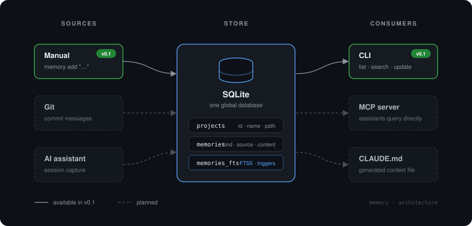

# memory

A persistent, project-scoped memory layer for AI coding assistants.

`memory` stores the decisions, patterns and bug fixes that accumulate while working on a codebase, and makes them searchable from the command line — and later, from tools like Claude Code via MCP. It is a small Rust CLI backed by SQLite.

> **Status:** early development (v0.1 in progress). See [Roadmap](#roadmap).

## Why

AI coding assistants start every session with no memory of the project. They re-learn the architecture, re-discover the same constraints, and sometimes re-introduce bugs that were already fixed. The knowledge exists — in commit messages, in your head, in yesterday's conversation — but nothing collects it in a form the assistant can query.

`memory` is that collector. You (or a tool) record short entries as work happens; the assistant reads them back when it needs context.

## How it works



- **Sources** feed entries in. v0.1 supports manual entry only; git commit ingestion and AI-assisted capture come next.
- **Store** is a single SQLite database with full-text search (FTS5). Every entry belongs to a project.
- **Consumers** read entries out. v0.1 ships the CLI; an MCP server is planned so assistants can query memory directly.

## Data model

Each memory has:

| Field        | Description                                              |
|--------------|----------------------------------------------------------|
| `project_id` | The project it belongs to                                |
| `kind`       | `decision` · `pattern` · `bug` · `note`                  |
| `source`     | `manual` · `git`                                         |
| `source_ref` | Optional reference into the source (e.g. a commit hash)  |
| `content`    | Free text, indexed for search                            |
| `created_at`, `updated_at` | Set by the database                        |

Projects are identified by their absolute path on disk.

## Usage

*Target interface for v0.1 — not all commands are implemented yet.*

```sh
# Register the current directory as a project
memory init

# Record entries (project is detected from the current directory)
memory add --kind decision "Using Traefik sticky sessions via cookie, not IP hash"
memory add --kind bug      "Redis pool exhausted under load; pool size raised to 50"

# Target another project explicitly
memory add --project cashier --kind note "..."

# Read back
memory list
memory list --kind decision
memory search redis

# Maintain
memory update 12 "Corrected content"
memory delete 12
```

Project resolution: `--project <name>` if given, otherwise walk up from the current directory until a registered project path matches — the same way `git` finds `.git`.

## Design decisions

- **SQLite from day one, not JSON.** Search, filtering and updates are trivial in SQL; a flat file would need all three rebuilt by hand.
- **One global database**, not one per project. Cross-project search ("did I solve this elsewhere?") is a core use case. Per-repo export/sync for team sharing is a later addition that doesn't change the schema.
- **FTS5 as an external-content table** over `memories`, kept in sync by triggers. Search is a `MATCH` query, no application-side indexing.
- **Enums stored as `TEXT` with `CHECK` constraints.** Readable in `sqlite3`, and invalid values are rejected at the database layer.
- **Timestamps as ISO-8601 `TEXT`, set by the database** (`DEFAULT (datetime('now'))`, UTC). Human-readable, sorts correctly, no conversion on the Rust side.
- **No raw-event layer in v0.1.** A nullable `source_ref` column keeps the door open for linking entries to commits or conversations later.
- **No tags in v0.1.** `kind` is the only classification for now; tags will be multi-valued when added.

## Roadmap

- [x] Data model (`model.rs`)
- [x] Schema: `projects`, `memories`, FTS5 index, sync triggers
- [ ] Store: open, migrate, CRUD, search (`store.rs`)
- [ ] Project resolution from working directory (`project.rs`)
- [ ] CLI: `init` / `add` / `list` / `search` / `update` / `delete` (`cli.rs`)
- [ ] Git source: ingest commit messages
- [ ] MCP server so assistants can query memory directly
- [ ] `CLAUDE.md` generator
- [ ] Tags

## Development

```sh
cargo build
cargo run -- --help

# Test the schema directly
sqlite3 test.db < src/schema.sql
sqlite3 test.db ".schema"
```

Requires Rust (stable). SQLite is bundled via `rusqlite`; no system installation needed.
